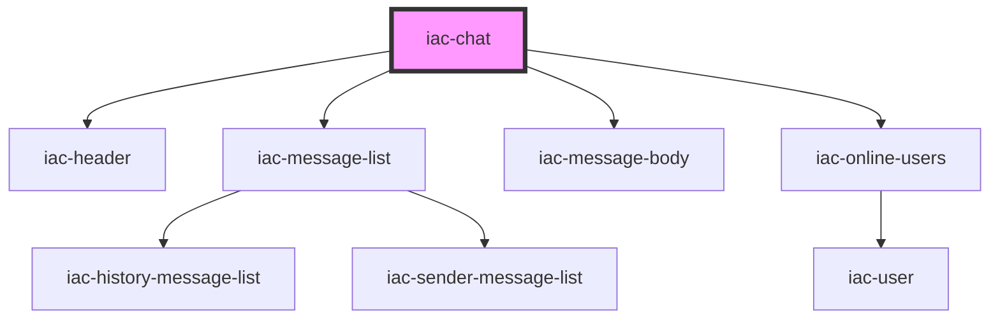

# iac-chat-container

<!-- Auto Generated Below -->

## Properties

| Property             | Attribute              | Description | Type     | Default          |
| -------------------- | ---------------------- | ----------- | -------- | ---------------- |
| `channelName`        | `channel-name`         |             | `string` | `"test-channel"` |
| `historyLoaded`      | `history-loaded`       |             | `any`    | `undefined`      |
| `historyMessages`    | `history-messages`     |             | `any`    | `undefined`      |
| `lastMessageWeekday` | `last-message-weekday` |             | `any`    | `undefined`      |
| `messageSentDate`    | `message-sent-date`    |             | `any`    | `undefined`      |
| `networkErrorImg`    | `network-error-img`    |             | `any`    | `undefined`      |
| `networkErrorStatus` | `network-error-status` |             | `any`    | `undefined`      |
| `onlineUsers`        | `online-users`         |             | `any`    | `undefined`      |
| `onlineUsersCount`   | `online-users-count`   |             | `number` | `0`              |
| `pubnub`             | `pubnub`               |             | `any`    | `undefined`      |
| `sendersInfo`        | --                     |             | `any[]`  | `undefined`      |
| `state`              | `state`                |             | `any`    | `undefined`      |
| `userProfile`        | `user-profile`         |             | `any`    | `undefined`      |
| `users`              | `users`                |             | `any`    | `undefined`      |
| `uuid`               | `uuid`                 |             | `any`    | `undefined`      |

## Events

| Event             | Description | Type               |
| ----------------- | ----------- | ------------------ |
| `messageReceived` |             | `CustomEvent<any>` |

## Dependencies

### Depends on

- [iac-header](../../header)
- [iac-message-list](../../message-list)
- [iac-message-body](../message-body)
- [iac-online-users](../../online-users)

### Graph

----------------------------------------------

*Built with [StencilJS](https://stenciljs.com/)*
