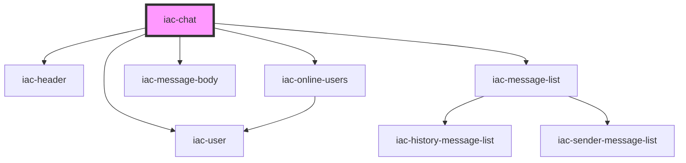

# iac-chat-container

<!-- Auto Generated Below -->

## Properties

| Property      | Attribute      | Description | Type  | Default     |
| ------------- | -------------- | ----------- | ----- | ----------- |
| `pubnub`      | `pubnub`       |             | `any` | `undefined` |
| `state`       | `state`        |             | `any` | `undefined` |
| `userProfile` | `user-profile` |             | `any` | `undefined` |
| `uuid`        | `uuid`         |             | `any` | `undefined` |

## Dependencies

### Depends on

- [iac-header](../../header)
- [iac-user](../../user)
- [iac-online-users](../../online-users)
- [iac-message-body](../message-body)
- [iac-message-list](../../message-list)

### Graph

----------------------------------------------

*Built with [StencilJS](https://stenciljs.com/)*
