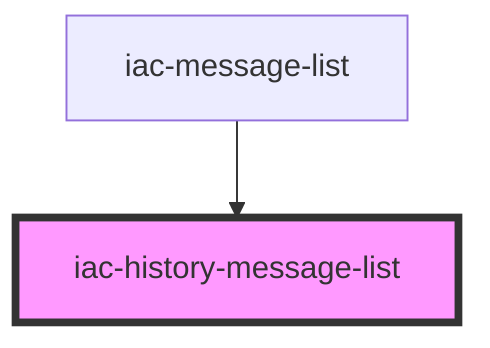

# iac-history-message-list

<!-- Auto Generated Below -->

## Properties

| Property             | Attribute              | Description | Type  | Default     |
| -------------------- | ---------------------- | ----------- | ----- | ----------- |
| `getUserAvatarUrl`   | `get-user-avatar-url`  |             | `any` | `undefined` |
| `historyLoaded`      | `history-loaded`       |             | `any` | `undefined` |
| `historyMessages`    | `history-messages`     |             | `any` | `undefined` |
| `networkErrorImg`    | `network-error-img`    |             | `any` | `undefined` |
| `networkErrorStatus` | `network-error-status` |             | `any` | `undefined` |
| `users`              | `users`                |             | `any` | `undefined` |
| `uuid`               | `uuid`                 |             | `any` | `undefined` |

## Dependencies

### Used by

 - [iac-message-list](../../message-list)

### Graph

----------------------------------------------

*Built with [StencilJS](https://stenciljs.com/)*
