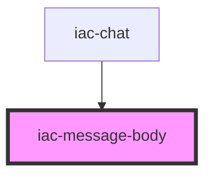

# iac-message-body

<!-- Auto Generated Below -->

## Properties

| Property      | Attribute      | Description | Type  | Default     |
| ------------- | -------------- | ----------- | ----- | ----------- |
| `channelName` | `channel-name` |             | `any` | `undefined` |
| `pubnub`      | `pubnub`       |             | `any` | `undefined` |
| `state`       | `state`        |             | `any` | `undefined` |
| `uuid`        | `uuid`         |             | `any` | `undefined` |

## Dependencies

### Used by

 - [iac-chat](../chat)

### Graph

----------------------------------------------

*Built with [StencilJS](https://stenciljs.com/)*
