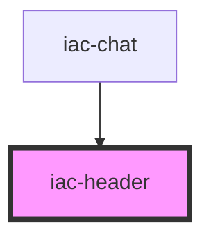

# iac-header

<!-- Auto Generated Below -->

## Properties

| Property           | Attribute            | Description             | Type     | Default     |
| ------------------ | -------------------- | ----------------------- | -------- | ----------- |
| `onlineUsersCount` | `online-users-count` | Total users online      | `number` | `undefined` |
| `userProfile`      | `user-profile`       | The user profile object | `any`    | `undefined` |

## Dependencies

### Used by

 - [iac-chat](../containers/chat)

### Graph

----------------------------------------------

*Built with [StencilJS](https://stenciljs.com/)*
