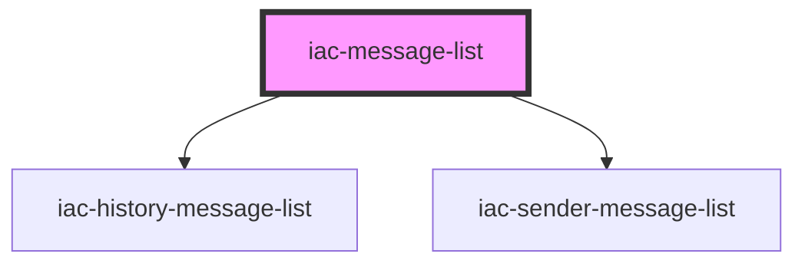

# iac-message-list

<!-- Auto Generated Below -->

## Properties

| Property          | Attribute           | Description        | Type                | Default     |
| ----------------- | ------------------- | ------------------ | ------------------- | ----------- |
| `historyLoaded`   | `history-loaded`    | Is History Loaded? | `boolean`           | `undefined` |
| `historyMessages` | `history-messages`  | History Messages   | `any`               | `undefined` |
| `messageSentDate` | `message-sent-date` | Message Send Date  | `any`               | `undefined` |
| `sendersInfo`     | `senders-info`      | Senders Info       | `any`               | `undefined` |
| `user`            | --                  | user               | `{ uuid: string; }` | `undefined` |
| `uuid`            | `uuid`              | User uuid          | `string`            | `undefined` |

## Dependencies

### Depends on

- [iac-history-message-list](../containers/history-message-list)
- [iac-sender-message-list](../sender-message-list)

### Graph

----------------------------------------------

*Built with [StencilJS](https://stenciljs.com/)*
