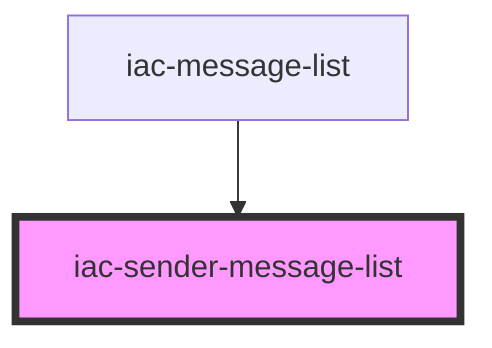

# iac-sender-message-list

<!-- Auto Generated Below -->

## Properties

| Property                | Attribute                  | Description | Type  | Default     |
| ----------------------- | -------------------------- | ----------- | ----- | ----------- |
| `getDate`               | `get-date`                 |             | `any` | `undefined` |
| `getTime`               | `get-time`                 |             | `any` | `undefined` |
| `getUserAvatarUrl`      | `get-user-avatar-url`      |             | `any` | `undefined` |
| `getUserName`           | `get-user-name`            |             | `any` | `undefined` |
| `sendersInfo`           | `senders-info`             |             | `any` | `undefined` |
| `styleForMessageSender` | `style-for-message-sender` |             | `any` | `undefined` |

## Dependencies

### Used by

 - [iac-message-list](../message-list)

### Graph

----------------------------------------------

*Built with [StencilJS](https://stenciljs.com/)*
