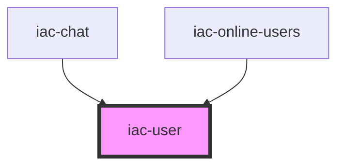

# iac-user

<!-- Auto Generated Below -->

## Properties

| Property       | Attribute        | Description | Type  | Default     |
| -------------- | ---------------- | ----------- | ----- | ----------- |
| `loggedInUser` | `logged-in-user` |             | `any` | `undefined` |
| `user`         | `user`           | User object | `any` | `undefined` |

## Dependencies

### Used by

 - [iac-chat](../containers/chat)
 - [iac-online-users](../online-users)

### Graph

----------------------------------------------

*Built with [StencilJS](https://stenciljs.com/)*
